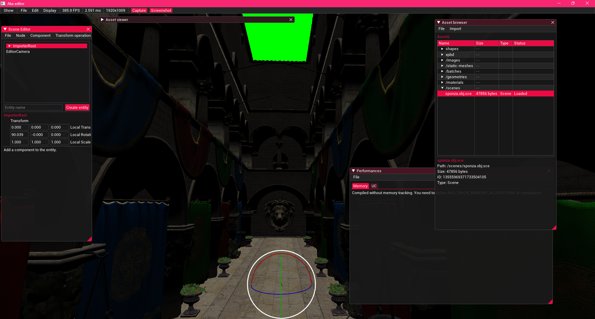

# AkaEngine

Didactic 3D engine based on [Aka framework](https://github.com/antaalt/Aka), which mostly focus on having solid foundation. Rendering is really basic for now.

## Features
- Asset manager
- Shader hot reload
- Vulkan based gfx backend
- Static & skeletal mesh rendering
- Scene importing via assimp

## Roadmap
- Some multithreading (via worker for asset loading & co)
- Asset indexer
  - Asset hot reloading
  - Shader indexation
- Rendering improvements
  - SSAO
  - Shadow mapping (CSM)
  - Directional lights / point lights / spot lights
  - Ray tracing shadows / lightings
  - Transparent rendering
  - FXAA
  - Skybox
- Blender renderer via python API ?
- A Game ???